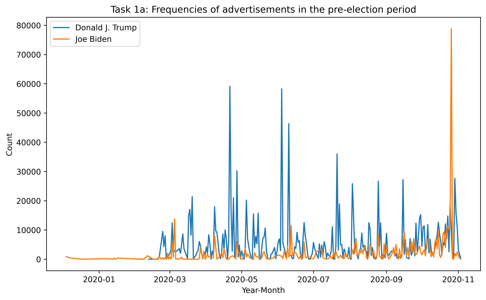
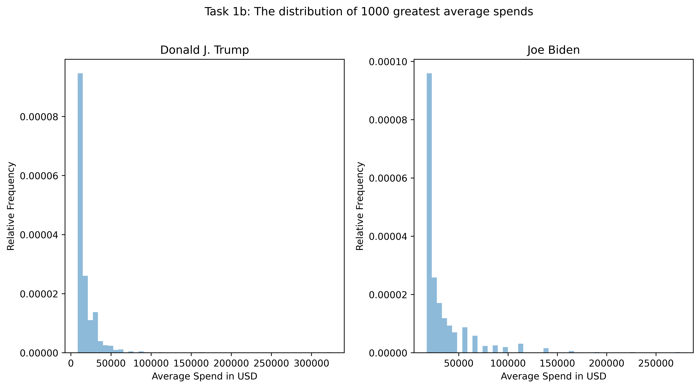

## Big-Data-Analytics-on-2020-US-Election
- Extracted electoral insights from Facebook Advertising Data: 6.6×10^7 rows across json files on HDFS on an AWS cluster
- Filtered and preprocessed Trump/Biden’s data. Analyzed behavior/style differences by noSQL/SQL operations
- Results. Trump spent less on more ads in the shorter term, Biden did the opposite. Trump was favored by those aged 35+, while Biden 18-35. Trump’s ads focused on himself, while Biden was more aware of the opponent

